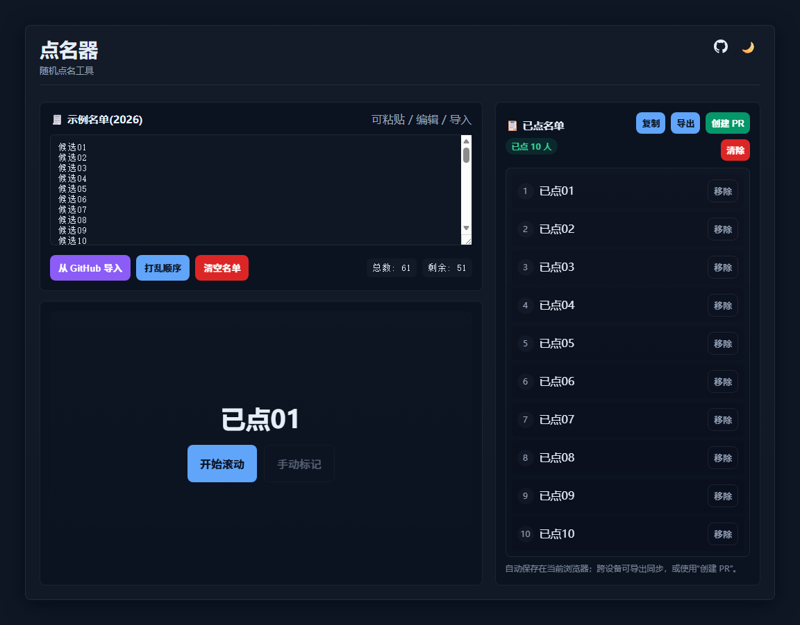

# 点名器（Rollcall）

一个简单易用的网页点名工具，支持名单管理、随机抽取、已点名单保存与导出，适合教师、活动主持人等场景。可直接部署到 GitHub Pages，无需后端。

## 功能简介

- 名单录入：支持手动输入和从 GitHub 仓库导入 CSV（当前读取仓库根目录下的 CSV 文件）。
- 名单清洗：输入框失焦后自动清除空行，并按行解析姓名（支持换行/逗号/分号分隔，自动去重）。
- 随机点名：点击“开始滚动”随机抽取未点名单，点击“停止”即选中当前姓名。
- 已点名单管理：支持手动移除、复制、导出、清除，并实时更新按钮可用状态。
- 本地持久化：待点名单、已点名单、主题和当前名单名会保存在浏览器 localStorage。
- 名单命名：导入 CSV 时自动使用文件名作为名单名；手动输入时自动生成中文名单名（如“手动名单-30人”）并随人数变化更新。
- 创建 PR：可将已点名单直接提交到 GitHub 仓库并自动创建 Pull Request，默认标题和文件名会带上当前名单名。
- 主题切换：支持白天/夜间模式，自动适配系统主题。

## 使用方法

1. 打开 `index.html`，在浏览器中访问即可使用。
2. 录入名单：可手动输入/粘贴姓名（建议每行一个），或点击“从 GitHub 导入”并输入 `owner/repo` 选择 CSV 文件。
3. 点击“开始滚动”，再点击“停止”抽取一名；可重复直到名单结束。
4. 使用“手动标记”可快速将选中姓名移入已点名单。
5. 已点名单可“复制 / 导出 / 创建 PR / 清除”。
6. 需要重置时可使用“清空名单”（会清空待点和已点，并重置名单名）。

## 创建 PR 说明

1. 在“已点名单”区域点击“创建 PR”。
2. 填写目标仓库、文件路径和 PAT（个人访问令牌）。
3. 默认会自动生成文件路径（包含当前名单名 + 时间戳）、PR 标题（包含当前名单名 + 日期）和分支名（按日期生成）。
4. 点击“创建 PR”后，工具会在目标仓库创建/使用分支、提交名单文件并发起 PR。

> 提示：私有仓库通常需要 `repo` 权限，公开仓库通常需要 `public_repo` 权限；PAT 仅在当前会话内使用，不会保存到 localStorage。

## 部署到 GitHub Pages

1. Fork 或 clone 本仓库。
2. 在 GitHub 仓库设置中启用 Pages，选择 `main` 分支和根目录。
3. 稍等片刻，即可通过 GitHub Pages 链接访问。

## 文件结构

- `index.html`：页面结构与各功能入口（导入、点名、PR 模态框等）。
- `script.js`：核心交互逻辑（点名、存储、CSV 导入、PR 创建、名单命名等）。
- `styles.css`：页面样式与主题。
- `image/`：项目截图等资源。
- `LICENSE`：Apache License 2.0。

## 许可协议

Apache License 2.0。欢迎自由使用、修改和分发，但请遵守相关条款。

## AI使用说明

本项目原始代码是基于ChatGPT-4生成的，后经由CodeBuddy进行代码优化。因此，项目全部基于AI生成，不包含任何人工代码。不过，本人对代码做了审阅和测试，确保其基本功能和稳定性。

---

如有建议或问题，欢迎提交 Issue。
